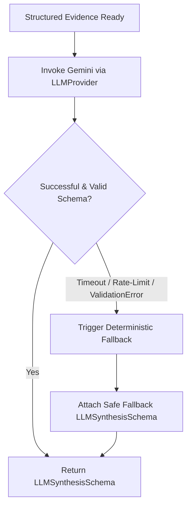

# Grounded Generative AI & Gemini Architecture

This document details the generative AI architecture in **Vantage**, specifically how Google Gemini (configured as `gemini-3.6-flash`) is integrated, prompt engineering guardrails, structured schema validation, and fallback mechanisms.

---

## 1. Architectural Role of Generative AI

In Vantage, the Large Language Model (LLM) is **not** an analytical oracle and does **not** calculate risk scores. The deterministic analytical engine (`SafetyAssessmentService`) retains sole authority over risk categorization, hazard detection, and metric verification.

The LLM serves two specialized functions:

1. **Evidence Synthesis:** Transforming complex multi-source evidence (weather telemetry, traffic congestion, historical cluster statistics, and GNN topological risks) into clear, concise executive narratives.
2. **Actionable Guidance:** Translating empirical hazards into specific, evidence-linked precautions for drivers and fleet managers.

---

## 2. Model Configuration & Runtime Settings

Configuration is managed in `backend/app/config.py`:

| Parameter | Default Value | Purpose |
| --- | --- | --- |
| `LLM_PRIMARY_PROVIDER` | `"gemini"` | Active provider router target (`gemini` or `claude`). |
| `GEMINI_MODEL` | `gemini-3.6-flash` | Configured Gemini model identifier. |
| `LLM_TEMPERATURE` | `0.2` | Low temperature to enforce deterministic, non-creative outputs. |
| `LLM_TIMEOUT_SECONDS` | `60.0` | Maximum round-trip request timeout. |
| `LLM_MAX_RETRIES` | `2` | Automatic retries with exponential backoff on transient network failures. |
| `LLM_RETRY_BASE_DELAY` | `1.0s` | Initial delay between retry attempts. |
| `LLM_RETRY_MAX_DELAY` | `4.0s` | Maximum backoff cap. |

---

## 3. Strict Grounding Constraints

The prompt engineering engine (`backend/app/services/journey_prompt_service.py`) injects **18 mandatory negative grounding rules** into the system prompt:

1. **Strict Evidence Boundary:** Use *only* the supplied structured JSON evidence. Never invent facts, data sources, or figures.
2. **Honest Availability Reporting:** Never infer unavailable data as available. If a feed is unmonitored or missing, state it explicitly.
3. **No Fabricated Composite Scores:** Never create numerical risk scores or composite percentages (`overall_score` is intentionally null; do not fabricate one).
4. **No Arbitrary Safety Levels:** Never assign route-wide safety level categories if they are null in the input.
5. **No Synthetic Confidence Scores:** Never invent confidence percentages or statistical significance claims.
6. **No Fabricated Casualties:** Never fabricate collision counts or casualty numbers not present in the historical evidence payload.
7. **No Geographic Extrapolation:** Never extrapolate UK historical models (Student B or C) to routes outside Great Britain.
8. **Hotspot Absence Semantics:** Never treat the absence of a DBSCAN hotspot (0 matched clusters) as proof that zero collisions have occurred.
9. **Model Scope Separation:** Never treat Student A (Random Forest crash severity model) as a route-level prospective risk model.
10. **Live Telemetry Integrity:** Never claim traffic or incident disruptions exist if the corresponding feeds are unavailable or unmonitored.
11. **Explicit Limitation Recording:** If evidence is missing (e.g. traffic unmonitored outside London or historical models out-of-coverage), explicitly record it under limitations and state it in findings.
12. **Evidence-Linked Recommendations:** Actionable recommendations must connect directly to observed evidence (e.g. wet road grip, severe congestion, structural bottleneck).
13. **Status Mirroring:** If the input deterministic assessment is marked `partial` or `unavailable`, the synthesis status must match accordingly.
14. **Clean User-Facing Output:** Never output meta-commentary, prompt instructions, schema definitions, internal variable names, or lists of technical keywords.
15. **Concise Narrative Summary:** The summary must be a concise 2-4 sentence narrative strictly grounded in verified evidence.
16. **Provider Geographic Scoping Guardrail:** If a live provider (such as TfL traffic or disruptions) is marked `provider_unsupported_for_geography` or `unavailable`, NEVER interpret this as 'no incidents', 'no traffic', 'zero disruptions', or 'clear road'. Explicitly state that live traffic or disruption monitoring is unavailable for this geography.
17. **Non-UK Journey Integrity:** Never claim or imply that a non-UK route (e.g. Paris) has no incidents or zero traffic simply because a UK-specific provider (TfL) does not cover it.
18. **Partial Route Coverage Integrity:** If a live provider only partially covers a route (e.g. `provider_partially_supported`, such as London to Birmingham where TfL covers only the London portion), explicitly state that traffic and incident monitoring applies ONLY to the London portion of the route, and that the remainder of the corridor is unmonitored. Never claim or imply route-wide clear roads, zero incidents, or smooth traffic for the entire journey based solely on London-portion telemetry.

---

## 4. Structured Output Contract (`LLMSynthesisSchema`)

Gemini responses are parsed and strictly validated against Pydantic v2 schemas:

```python
class LLMKeyFindingSchema(BaseModel):
    title: str
    description: str
    severity: Literal["critical", "high", "moderate", "low", "unknown"]
    evidence_sources: list[str]

class LLMRecommendationSchema(BaseModel):
    action: str
    reason: str
    evidence_sources: list[str]

class LLMSynthesisSchema(BaseModel):
    status: DataAvailabilityStatus
    headline: Optional[str]
    summary: Optional[str]
    key_findings: list[LLMKeyFindingSchema]
    recommendations: list[LLMRecommendationSchema]
    limitations: list[str]
```

---

## 5. Resilience, Circuit Breaking & Fallback Architecture

To ensure the platform never fails due to an external AI outage, the synthesis pipeline is wrapped in comprehensive fault-tolerant error boundaries:



### Deterministic Fallback Schema

If Gemini times out, hits rate limits, or fails Pydantic schema validation, the system continues uninterrupted:

- The verified **Deterministic Safety Assessment** is returned to the user in full.
- An informative fallback explanation is attached:

  ```json
  {
    "status": "unavailable",
    "headline": "Deterministic Route Assessment (AI Synthesis Offline)",
    "summary": "AI synthesis is temporarily unavailable for this journey. Please refer to the verified deterministic safety factors and telemetry above.",
    "key_findings": [],
    "recommendations": [],
    "limitations": ["AI synthesis temporarily unavailable: [Safe Error Note]"]
  }
  ```

---

## 6. Multi-Provider Router (`LLMProviderRouter`)

While Google Gemini is the primary engine, `backend/app/services/llm_provider_router.py` provides an abstraction layer supporting Anthropic Claude (`claude-3-7-sonnet-20250219`). If configured, the router can route requests between providers without requiring any frontend or business-logic modifications.
