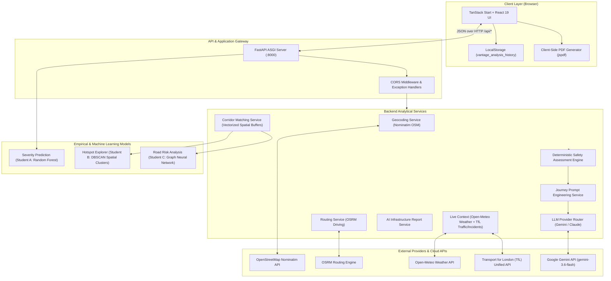
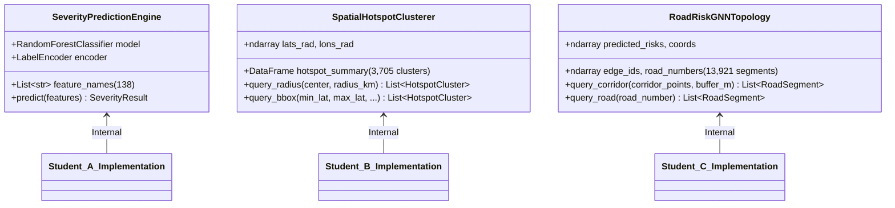
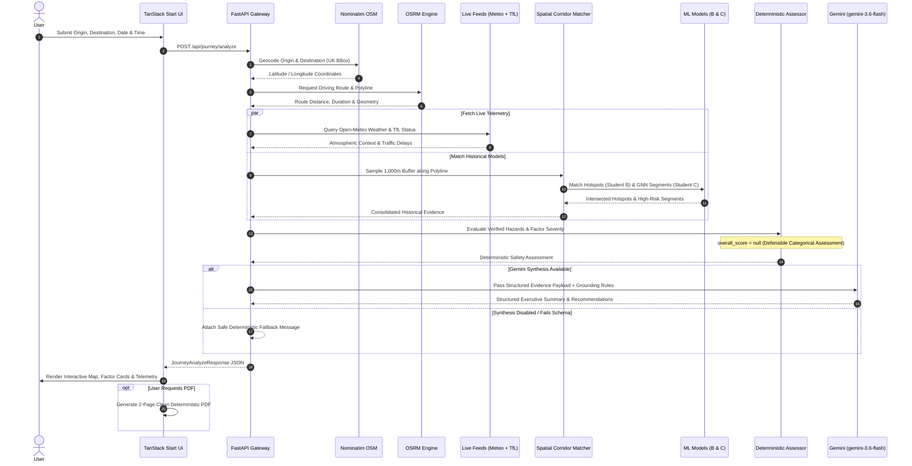

# Vantage System Architecture

This document describes the end-to-end architecture of **Vantage**, including component interactions, service boundaries, data pipelines, external integrations, and persistence mechanisms.

---

## 1. High-Level Architecture

Vantage is organized into a modular decoupled architecture comprising a TypeScript/React frontend, a Python/FastAPI analytical backend, precomputed and real-time machine learning inference engines, external geospatial/telemetry feeds, and grounded generative AI synthesis.

---

## 2. Frontend Layer

The frontend application is built using **TanStack Start** (full-stack framework powered by Vite and Nitro) and **React 19**.

- **Routing:** File-based routing implemented via `@tanstack/react-router` in `frontend/src/routes/`.
- **Layout Hierarchy:** `__root.tsx` mounts the global theme and HTML skeleton. `AppShell` encapsulates the collapsible navigation sidebar (`AppSidebar`) and top action bar (`AppNavbar`).
- **State Management & Data Fetching:** Server communication is handled using `@tanstack/react-query` mutations and native fetch clients in `frontend/src/lib/api/client.ts`.
- **UI Components:** Styled with **Tailwind CSS v4** and accessible primitives from **Radix UI**, with iconography from **Lucide React**.
- **Interactive Mapping:** Geographic coordinates and journey corridors are rendered using **Leaflet** with custom tile layers.
- **Client-Side Document Export:** PDF reports are compiled entirely client-side using `jspdf` and `jspdf-autotable`, rendering two-page deterministic documents without server-side headless browser overhead.
- **History Storage:** Analysis runs and queries are saved locally in the browser's `localStorage` (`vantage_analysis_history`) with zero backend user-session tracking.

---

## 3. Backend Layer

The backend is built with **FastAPI** (Python 3.12+), utilizing **Pydantic v2** for strict data validation and serialization.

### Application Lifecycle & Lifespan Management

FastAPI's `@asynccontextmanager lifespan` in `backend/app/main.py` manages singleton initialization during application startup:

1. **Student A Model:** `SeverityModelManager.get_instance().load()` pre-loads the Random Forest classifier and feature definitions into memory.
2. **Student B Hotspots:** `HotspotDataManager().load()` reads precomputed DBSCAN cluster centroids (`data/output/hotspot_summary.csv`) and caches vectorized radian coordinates for fast Haversine filtering.
3. **Student C Risk Graph:** `RiskDataManager().load()` parses topological road segment risks (`student_C/gnn_risk_predictions.json`) into contiguous NumPy arrays.
4. **Corridor Spatial Indexes:** `CorridorMatchingService.prewarm()` ensures spatial index structures are instantiated prior to serving live traffic.

### Router Architecture

All domain routers are mounted both at the root level and under `/api` for backwards compatibility:

- `severity_route.py` $\rightarrow$ `/severity/predict`, `/severity/predict-batch`
- `hotspot_route.py` $\rightarrow$ `/hotspots/analyze`
- `risk_route.py` $\rightarrow$ `/road-risk/predict`, `/risk/assess` (legacy compatibility)
- `report_route.py` $\rightarrow$ `/reports/ai-infrastructure-report`
- `journey_route.py` $\rightarrow$ `/journey/analyze`

### Error Handling & Security

- **Unhandled Exceptions:** A centralized `unhandled_exception_handler` catches unhandled Python exceptions, generates a unique diagnostic `error_id` (`err-<12hex>`), logs the traceback securely, and returns an HTTP 500 without leaking internal stack traces.
- **CORS Middleware:** Configured via `settings.CORS_ORIGINS` supporting JSON arrays or comma-separated lists, allowing development origins while restricting unauthorized external access.

---

## 4. Machine Learning Model Layer

The analytical foundation of Vantage integrates three empirical models calibrated on the UK Road Safety Dataset:

1. **Severity Prediction (Student A):** Random Forest classifier evaluating 138 transformed features for a specific crash scenario, outputting class probabilities across `Fatal`, `Serious`, and `Slight`.
2. **Hotspot Explorer (Student B):** DBSCAN spatial clustering identifying 3,705 empirical collision concentration zones across Great Britain, indexing cluster centroids, accident counts, and severity breakdowns.
3. **Road Risk Analysis (Student C):** Graph Neural Network (GNN) modeling structural and topological crash likelihood over 13,921 UK road segments, capturing node connectivity and edge betweenness.

---

## 5. External Telemetry & Service Integrations

| Provider | Service | Integration Type | Fallback / Resilience |
| --- | --- | --- | --- |
| **OpenStreetMap Nominatim** | Forward Geocoding | HTTP REST API | In-memory LRU cache (512 entries, 1 hr TTL), strict UK bounding box validation |
| **OSRM (Project OSRM)** | Vehicle Route Planning | HTTP REST API | Polyline geometry decoding, multi-point coordinate sampling |
| **Open-Meteo** | Atmospheric Telemetry | HTTP REST API | Hourly forecast query at origin, destination, and midpoint |
| **Transport for London (TfL)** | Live Traffic Delays & Incidents | HTTP REST API (Unified) | Scoped strictly to Greater London road network; marks non-London as unmonitored |
| **Google Gemini API** | Evidence Synthesis | Google GenAI SDK | Multi-tier retry, circuit breaker, timeout limits, deterministic fallback |

---

## 6. End-to-End Journey Safety Pipeline

The primary workflow of Vantage is the multi-source **Journey Safety Analysis** pipeline (`backend/app/services/journey_service.py`):

---

## 7. Responsibility Boundaries

To maintain scientific integrity and operational stability, strict separation of concerns is enforced:

- **Deterministic Authority:** The backend deterministic scoring engine (`safety_assessment_service.py`) is the sole authority on route risk factors, severity tiers, and hazard identification.
- **Generative Role:** Gemini acts solely as an evidence synthesizer and human-readable communicator. It is bound by 13 negative constraints prohibiting the fabrication of scores, numbers, or unmonitored conditions.
- **Client Responsibilities:** The browser handles presentation, route geometry decoding, interactive map rendering, PDF compilation, and local query history storage.
- **Provider Isolation:** Failures in external live feeds (e.g. TfL outage or weather rate-limit) degrade gracefully to `partial` or `unavailable` statuses without aborting the overall journey analysis.
