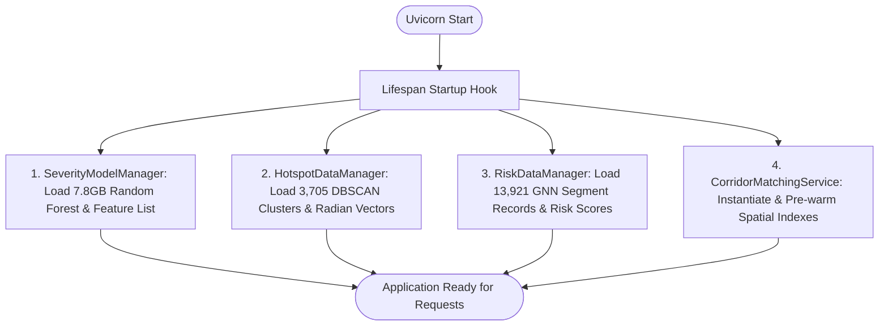

# Vantage Backend Architecture

This document details the architecture, request lifecycle, service boundaries, model loading mechanisms, configuration management, and resilience patterns of the **Vantage** backend application.

---

## 1. Core Framework & Entrypoint

The backend is developed in Python (3.12+) using **FastAPI** (`fastapi==0.141.1`), **Uvicorn** (`uvicorn==0.52.1`), and **Pydantic v2** (`pydantic==2.13.4`).

- **Entrypoint File:** `backend/app/main.py`
- **Application Instance:** `app = FastAPI(...)`
- **ASGI Factory:** `uvicorn app.main:app --host 0.0.0.0 --port 8000`

---

## 2. Startup Lifespan & Pre-warming

FastAPI’s modern `@asynccontextmanager lifespan` protocol governs startup resource allocation. To ensure zero-latency inference on the first incoming request, the lifespan handler eagerly loads models and precomputes spatial index structures:



1. **Student A (Severity):** Deserializes the scikit-learn Random Forest classifier, label encoders, and 138-feature list from `student_A/models/`.
2. **Student B (Hotspots):** Parses `data/output/hotspot_summary.csv` into a Pandas DataFrame and extracts precomputed latitude/longitude radian arrays (`_lats_rad`, `_lons_rad`) for vectorized Haversine distance computations.
3. **Student C (Road Risk):** Loads `student_C/gnn_risk_predictions.json` containing 13,921 UK road segments into contiguous NumPy arrays for zero-copy slicing.
4. **Spatial Pre-warming:** Pre-instantiates memory structures in `CorridorMatchingService` to eliminate cold-start penalties on route queries.

---

## 3. Configuration Management

Configuration is managed via Pydantic Settings (`pydantic-settings==2.15.0`) in `backend/app/config.py`:

```python
class Settings(BaseSettings):
    APP_NAME: str = "Road Accident Severity Prediction & Hotspot Analysis"
    APP_VERSION: str = "1.0.0"
    API_PREFIX: str = "/api"
    ...
```

### Resolution Order

Values are resolved hierarchically (highest precedence first):

1. Shell environment variables (e.g. `export GEMINI_API_KEY="..."`).
2. `.env` file located at `backend/.env`.
3. Default values declared in the `Settings` class.

### Key Configurable Properties

- `CORS_ORIGINS`: Allowed client origins, supporting both JSON arrays and comma-separated strings with safe localhost defaults.
- `LLM_PRIMARY_PROVIDER`: Configured as `"gemini"` (default) with multi-provider failover support.
- `GEMINI_API_KEY`, `GEMINI_MODEL`: Google Gemini authentication and model identifier (defaults to `gemini-3.6-flash`).
- `CLAUDE_API_KEY`, `CLAUDE_MODEL`: Anthropic fallback credentials.
- `GEOCODING_PROVIDER`, `ROUTING_PROVIDER`: Geospatial service definitions (Nominatim OSM and Project OSRM).
- `WEATHER_PROVIDER`, `TRAFFIC_PROVIDER`, `INCIDENT_PROVIDER`: Live telemetry providers (Open-Meteo and Transport for London).

---

## 4. Router Hierarchy

Every route module is mounted twice in `main.py`—once at root level and once under `/api`—ensuring universal compatibility with direct consumers and frontend proxy rules:

| Router Module | Domain Tag | Canonical Path | Aliased API Path |
| --- | --- | --- | --- |
| `severity_route.py` | Severity Prediction | `/severity/predict`, `/severity/predict-batch` | `/api/severity/predict`, `/api/severity/predict-batch` |
| `hotspot_route.py` | Hotspot Analysis | `/hotspots/analyze` | `/api/hotspots/analyze` |
| `risk_route.py` | Road Risk Prediction | `/road-risk/predict`, `/risk/assess` | `/api/road-risk/predict`, `/api/risk/assess` |
| `report_route.py` | Reports | `/reports/ai-infrastructure-report` | `/api/reports/ai-infrastructure-report` |
| `journey_route.py` | Journey Safety Analysis | `/journey/analyze` | `/api/journey/analyze` |
| `main.py` (system) | System | `/`, `/health` | `/docs`, `/redoc` |

---

## 5. Service Architecture & Separation of Concerns

The backend follows a service-oriented architectural pattern with strict boundary isolation:

```text
backend/app/
├── routes/              # Thin HTTP controller layer (request validation, status codes)
├── schemas/             # Pydantic v2 data transfer objects (DTOs)
├── services/            # Pure business logic and domain execution
│   ├── geocoding_service.py       # Nominatim forward geocoding with in-memory LRU cache
│   ├── routing_service.py         # OSRM polyline routing & waypoint sampling
│   ├── weather_service.py         # Open-Meteo atmospheric telemetry fetcher
│   ├── traffic_service.py         # TfL road congestion monitoring
│   ├── incident_service.py        # TfL road disruption & incident monitoring
│   ├── corridor_matching_service.py # Vectorized spatial buffer intersections
│   ├── safety_assessment_service.py # Deterministic risk factor scoring & rules
│   ├── journey_service.py         # End-to-end pipeline orchestrator
│   ├── journey_prompt_service.py  # Structured prompt engineering with negative constraints
│   ├── llm_provider_router.py     # Multi-provider routing (Gemini primary)
│   ├── llm_provider.py            # Gemini API integration & circuit breaker
│   ├── claude_provider.py         # Claude API integration
│   ├── severity_service.py        # Student A Random Forest manager & predictor
│   ├── student_a_transformer.py   # 138-feature one-hot encoding & normalization
│   ├── hotspot_service.py         # Student B DBSCAN cluster manager & spatial filter
│   ├── risk_service.py            # Student C GNN manager & topological search
│   ├── llm_report_service.py      # Multi-model infrastructure report orchestrator
│   ├── report_grounding_service.py# Structured multi-model evidence aggregator
│   └── report_prompt_service.py   # Infrastructure report prompt engineering
```

---

## 6. Exception Handling & Observability

### Centralized Exception Handler

Unhandled exceptions are intercepted by a global handler in `main.py`:

```python
@app.exception_handler(Exception)
async def unhandled_exception_handler(request: Request, exc: Exception) -> JSONResponse:
    if isinstance(exc, StarletteHTTPException):
        return JSONResponse(status_code=exc.status_code, content={"detail": exc.detail})

    error_id = f"err-{uuid.uuid4().hex[:12]}"
    logger.error("Unhandled exception [error_id=%s] on %s %s: %s", error_id, request.method, request.url.path, exc, exc_info=True)
    return JSONResponse(
        status_code=status.HTTP_500_INTERNAL_SERVER_ERROR,
        content={"detail": "An internal server error occurred.", "error_id": error_id},
    )
```

- Prevents leaking internal stack traces, file paths, or variable names to clients.
- Associates every unexpected 500 error with a traceable `error_id` for log correlation.

### Geospatial Error Mapping

In `journey_route.py`, domain-specific exceptions map to standard HTTP semantics:

- `LocationNotFoundError` $\rightarrow$ `HTTP 404 Not Found` (Geocoding failure)
- `RouteNotFoundError` $\rightarrow$ `HTTP 404 Not Found` (OSRM cannot connect origin and destination)
- `GeocodingTimeoutError` / `RoutingTimeoutError` $\rightarrow$ `HTTP 504 Gateway Timeout`
- `GeocodingProviderError` / `RoutingProviderError` $\rightarrow$ `HTTP 502 Bad Gateway`

---

## 7. Caching & Optimization Strategies

1. **Geocoding LRU Cache:** Forward geocoding lookups in `geocoding_service.py` are cached in memory with a default capacity of 512 locations and a 1-hour time-to-live (`GEOCODING_CACHE_TTL_SECONDS=3600.0`).
2. **Vectorized Haversine Math:** Instead of iterating through thousands of rows in Python, `HotspotDataManager` and `RiskDataManager` perform spatial distance calculations using vectorized NumPy trigonometric operations (`np.arcsin`, `np.clip`).
3. **Route Polyline Decimation:** Long journey geometries returned by OSRM are sampled at uniform distance intervals to prevent overwhelming spatial buffer queries and prompt token budgets.
