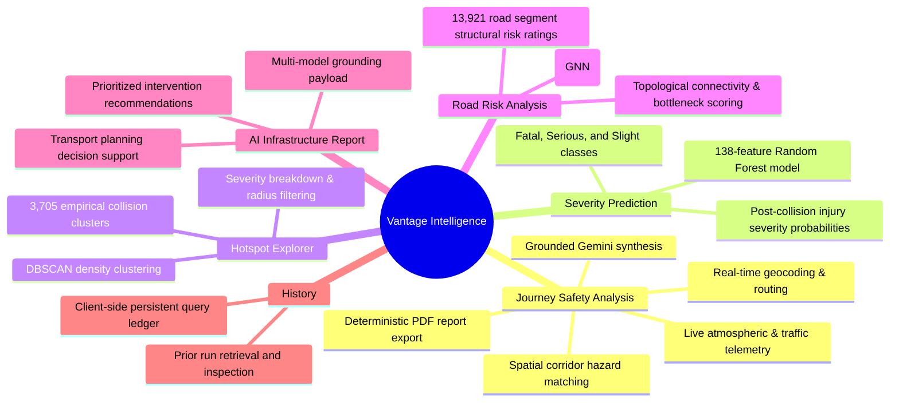

# Vantage System Overview

This document introduces **Vantage** from a product, functional, and scientific perspective. It explains the core problems the platform addresses, how its analytical models connect to the primary user workflow, and the principles governing data integrity.

---

## 1. Problem Statement

Road collisions remain one of the primary causes of preventable fatalities and severe injuries globally. Traditional transport intelligence platforms generally suffer from two critical limitations:

1. **Siloed Historical vs. Real-Time Data:** Retrospective crash frequency statistics are rarely unified with real-time operational conditions (e.g. wet road grip, active traffic jams, temporary construction disruptions).
2. **Pseudo-Scientific Metric Fabrication:** Many modern risk dashboards attempt to collapse heterogeneous, uncalibrated risk variables into a single arbitrary "safety percentage" (e.g. *"This road is 84% safe"*). Such arbitrary composites lack statistical defensibility, create a false sense of security, and obscure the specific hazards drivers or dispatchers face.

**Vantage** resolves these challenges by uniting empirical machine learning models (collision severity, spatial clustering, and graph neural network topological risk) with live environmental telemetry and grounded generative AI explanations—while strictly preserving deterministic authority.

---

## 2. Core Capabilities

Vantage provides six public functional modules:



---

## 3. The Three Information Layers

Every analysis in Vantage explicitly distinguishes between three independent tiers of intelligence:

```text
┌────────────────────────────────────────────────────────────────────────┐
│                        1. HISTORICAL EVIDENCE                          │
│  Empirical crash data from the UK Road Safety Dataset (2018–2023).     │
│  • 138-feature Random Forest severity classification (Student A).      │
│  • 3,705 precomputed DBSCAN accident clusters (Student B).             │
│  • 13,921 GNN road network topological risk scores (Student C).        │
└───────────────────────────────────┬────────────────────────────────────┘
                                    │
                                    ▼
┌────────────────────────────────────────────────────────────────────────┐
│                          2. LIVE CONTEXT                               │
│  Real-time environmental and operational telemetry along the corridor. │
│  • Open-Meteo hourly weather (precipitation, visibility, wind, temps). │
│  • Transport for London (TfL) live road network congestion status.     │
│  • TfL active incident disruptions and temporary roadworks.            │
└───────────────────────────────────┬────────────────────────────────────┘
                                    │
                                    ▼
┌────────────────────────────────────────────────────────────────────────┐
│                        3. GROUNDED AI SYNTHESIS                        │
│  Generative narrative powered by Google Gemini (gemini-3.6-flash).     │
│  • Strictly bounded by 13 negative constraints.                        │
│  • Translates verified quantitative metrics into executive takeaways.  │
│  • Suggests actionable, evidence-linked precautions.                   │
└────────────────────────────────────────────────────────────────────────┘
```

### Why This Distinction Matters

- **Historical evidence** tells us what has historically happened at a location or how the structural geometry of the road network predisposes it to risk.
- **Live context** tells us what is happening right now along the planned transit window.
- **AI synthesis** explains the interaction between history and live conditions in plain, actionable language without altering the underlying data.

---

## 4. How Models Relate to Journey Safety Analysis

While each machine learning model can be queried independently via dedicated explorer views, the **Journey Safety Analysis** workflow orchestrates them as interconnected evidentiary sources:

| Model / Module | Primary Independent Use | Role Inside Journey Safety Analysis |
| --- | --- | --- |
| **Severity Prediction** (`Student A`) | What is the expected injury distribution if a crash occurs under specific lighting, speed, and weather parameters? | Evaluates the prospective collision severity profile at the origin and destination under anticipated travel conditions. |
| **Hotspot Explorer** (`Student B`) | Where are the historical multi-vehicle crash clusters in a given district or bounding box? | Samples a 1,000-meter buffer along the route polyline to detect intersections with known high-density accident clusters. |
| **Road Risk Analysis** (`Student C`) | Which road segments possess high structural topological vulnerability based on graph connectivity? | Identifies route corridor segments carrying high topological risk scores ($\ge 0.08$) and flags structural bottlenecks. |

---

## 5. Geographic Assumptions & Coverage Bounds

Vantage enforces strict geographic boundaries to prevent invalid statistical extrapolations:

### 1. Great Britain National Boundary

- The historical machine learning models (Students A, B, and C) are trained and calibrated exclusively on the **UK Department for Transport (DfT) Road Safety Dataset** covering England, Scotland, and Wales.
- Valid coordinates fall within:
  $$\text{Latitude: } [50.0^\circ\text{ N}, 60.5^\circ\text{ N}], \quad \text{Longitude: } [-6.5^\circ\text{ E}, 2.0^\circ\text{ E}]$$
- If a user requests a journey outside Great Britain (e.g. Paris to Lyon), routing and weather will function normally, but historical model evidence will be marked `out_of_bounds` or `unavailable`. The system explicitly forbids projecting UK crash models onto non-UK geography.

### 2. Greater London Operational Telemetry Boundary

- Live traffic congestion and incident disruption feeds currently utilize the **Transport for London (TfL) Unified API**.
- Routes within Greater London receive full real-time traffic and incident feeds.
- Routes situated outside Greater London (e.g. Manchester to Leeds) gracefully mark traffic feeds as `unmonitored` / `unavailable`, rather than fabricating synthetic traffic data.

---

## 6. Deterministic Guardrails & The "Not Assigned" Score

One of the defining design decisions of Vantage is that **`overall_score` remains `None` (NOT ASSIGNED)** in the `SafetyAssessmentSchema`.

### Why No Single Composite Score?

Combining precipitation in millimeters, historical DBSCAN cluster counts, GNN topological graph weights, and TfL traffic delay seconds into a single number between 0 and 100 requires arbitrary scalar weighting coefficients (e.g. $0.4 \times \text{weather} + 0.3 \times \text{hotspots} + \dots$). Such weighting schemes:

- Are mathematically ungrounded and subjective.
- Obscure catastrophic single-factor risks (e.g. a journey with severe ice and road blockages might still receive a "72% safe" score if other factors are clear).
- Create legal and operational liability for transport operators.

Instead, Vantage computes **calibrated categorical risk tiers** (`low`, `moderate`, `high`, `critical`) for each individual verified hazard and reports an itemized evidence inventory, leaving the subjective decision-making authority with human dispatchers and drivers.
